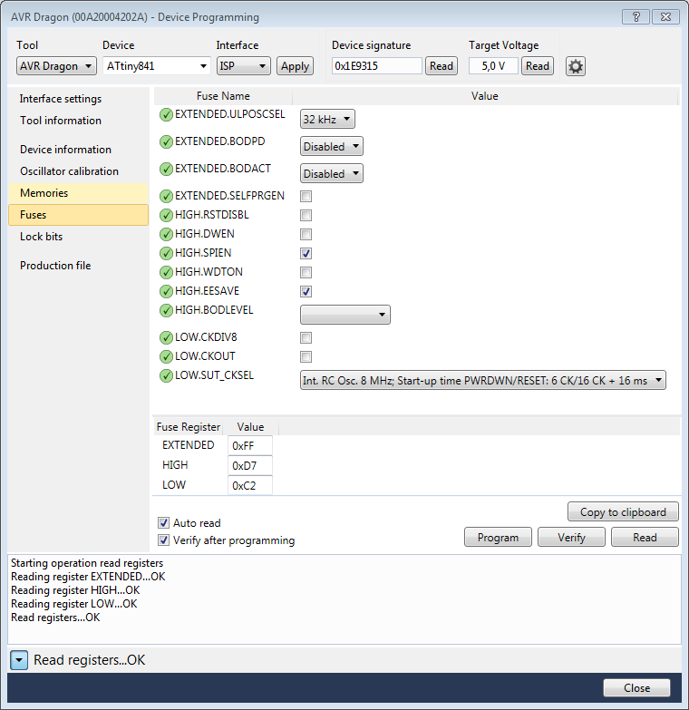

# Calibration of the internal RC oscillator

The procedure for calibrating the RC oscillator of an AVR8 microcontroller is described in the application note ATMEL [AVR053](http://www.atmel.com/images/doc2555.pdf). This application note does not explain the implementation of this procedure with an AVR Dragon and does not support recent microcontroller models such as tiny441/841, mega168P/328P and mega328PB. Few information is available on the web !

The purpose of this document is to describe the procedure for calibrating an RC oscillator with AVR Dragon.

## Principle of calibration

The adjustment of the RC oscillator of an AVR8 microcontroller is done by modifying the OSCCAL register. ATMEL performs a calibration at the output of the production line. This calibration value is that which can be read in the OSCCAL register after the RESET of the microcontroller.

To improve accuracy, a new calibration can be performed by calculating a new OSCCAL value. Once calculated, this value will be stored in EEPROM and used by the microcontroller program to adjust the setting.

Two pins are used for calibration: MOSI and MISO for an ISP interface, or TDI and TDO for a JTAG interface. For simplicity, we will use MOSI and MISO in the explanation below but it remains valid for TDI and TDO.

The basic principle is that the AVR Dragon generates a clock (at 32768 Hz) on MOSI and that the microcontroller uses this clock to calibrate its RC oscillator. When the microcontroller has successfully completed its calibration, it stores the calculated OSCCAL value in EEPROM and transmits OK to MISO.

To perform a calibration, you must:

1. Set the microcontroller fuses for an RC internal oscillator configuration, without division by 8. **It is preferable to activate the EEPROM protection fuse**  
2. Program the microcontroller with the calibration firmware (avr053)  
3. Perform calibration using PC software provided by ATMEL  

The calibration value stored in EEPROM will be used by the final program of the microcontroller to initialize OSCCAL.

## Installation

The calibration firmware can be found in the file [AVR053.zip](http://www.atmel.com/images/AVR053.zip). It can be downloaded from the ATMEL website.

Once decompressed, you have to add and modify some files to adapt it to the AVR Dragon and the new models of microcontrollers. To do this, you must copy all the files and folders that are in the folder avr-calibrate / AVR053 to the folder where you extracted [AVR053.zip](http://www.atmel.com/images/AVR053.zip), you will have to confirm the merge and the replacements ...

## Calibration with AVR Studio 6.2/7.0

* Open the solution file `rc_calib.atsln` with AvrStudio   
* Choose your microcontroller model in `Project> Properties > Device`

### Setting the Microcontroller Fuses

* `Tools > Device Programming` then `Tool >` AVR Dragon, `Device >` your MCU model, `Interface >` your programming interface, `Apply`  
* `Fuses` Tab :  
	* Check that the `SUT_CKSEL` fuse is set to `Int. RC Osc. 8 MHz`,
	* Check that the fuse `CKDIV8` is unchecked,
	* Check the `EESAVE` fuse
	* Click `Program`. It will probably be necessary to switch the ISP clock to 125 kHz and then return to 1 MHz...

### Assembling and programming the calibration firmware

You will find a number of ready-to-use firmwares in the root of [avr-calibrate](https://github.com/epsilonrt/avr-calibrate), if you find the firmware that corresponds to your microcontroller and your programmer, you can go to the next step else you must assemble your firmware :

* Modify the file `RC_Calibration.asm` in order to validate the line corresponding to the microcontroller used (`.include "Device specific\t841.asm"` for example) and to the programmer (`.include "Interface specific\isp_AVRDRAGON_interface.inc"` in our case). The other lines "Device specific" and "Interface specific" must be invalidated by putting a semicolon in front.  
* Click `Build> Build rc_calibrate` to assemble the firmware  
* `Tools > Device Programming > Memories`
In the `Flash` frame Click on `Program` (we will check that the `.hex` file is our `default\rc_calib.hex`)

The microcontroller is ready for calibration!

### Programming a ready-to-use firmware

For the following steps, use the ATMEL command line that was installed at the same time as AVR Studio (for example, AVR Studio 7.0 Command Prompt)

If you find the firmware that corresponds to your microcontroller and your programmer, you can program, for example:

        atprogram -t avrdragon -d attiny841 -i isp program -fl -c -f rc_calib_t841_dragon.hex
          Firmware check OK
          Oscillator calibration sequence succeeded.

### Reading microcontroller information

To read the default value of the OSCCAL register :

        atprogram -t avrdragon -i isp -d attiny841 info

OSCCAL is given, for example, 0x21

### Calibration

        atprogram -t avrdragon -d attiny841 calibrate
          Firmware check OK
          Oscillator calibration sequence succeeded.

### Reading the value in the EEPROM memory

The calculated value of OSCCAL is stored by the firmware in EEPROM at address 0x00 :

        atprogram -t avrdragon -d attiny841 -i isp read -ee -s 1 --format hex
          Firmware check OK
          1c

The value of OSCCAL is 0x1c.

### Copy the value at the top of the EEPROM

If the program C or C ++ running on the microcontroller uses the EEPROM, it is necessary to move this byte to the end of the EEPROM or to tell the link editor not to write anything in Address 0. By default, the GCC compiler linker stores the variables in EEPROM starting with address 0. If nothing is done, the first variable C or C ++ in EEPROM will overwrite the value calculated during the calibration.

It is possible to copy the calculated value to another address of the EEPROM (or FLASH!). For example for use with AvrIO or a microcontroller with 256 bytes of EEPROM, copy the value to address 0x00FF :

        atprogram -t avrdragon -d attiny841 -i isp write -ee -o 0xFF --values 1c
          Firmware check OK
          Write completed successfully.

## Using the Calibration Value

### With [AvrIO](https://github.com/epsilonrt/avrio)

        #include <avrio/osc.h>
        ...
        int main() {
          iOscCalibrateFromEE (AVRIO_OSCCAL);
          ....

### With the avr-gcc compiler (without AvrIO)

        #include <avr/io.h>
        #include <avr/eeprom.h>
        ...
        int main() {
          OSCCAL = eeprom_read_byte ((const uint8_t *)0x00FF)
          ....
